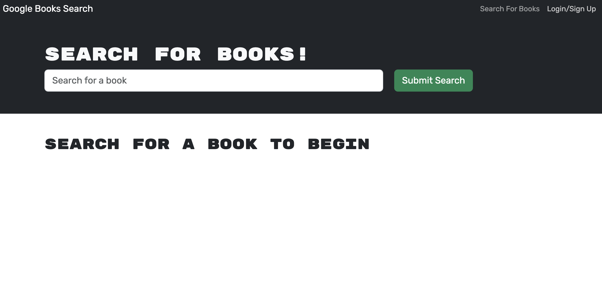

# MERN: Book Search Engine

## Description
The purpose of this application was to convert it from a RESTful API to a MERN stack with React frontend, MongDB database, and Node.js/Express.js server and API. It allows users to create an account, search books, and save them to the back end.

Application deployed through [Heroku](https://book-search-engine-mern-app-683531511cb1.herokuapp.com/)

  ## Table of Contents
  * [Usage](#usage)
  * [License](#license)
  * [Questions](#questions)

## [Usage](#table-of-contents)
To use, search any book in the search bar. To save the book, you must either make an account or login in the top right corner.

## [License](#table-of-contents)
This application has no license.

## [Questions](#Table-of-Contents)
If you have any questions contact developer here:

N. Stark: [Github](https://github.com/nstark12)

